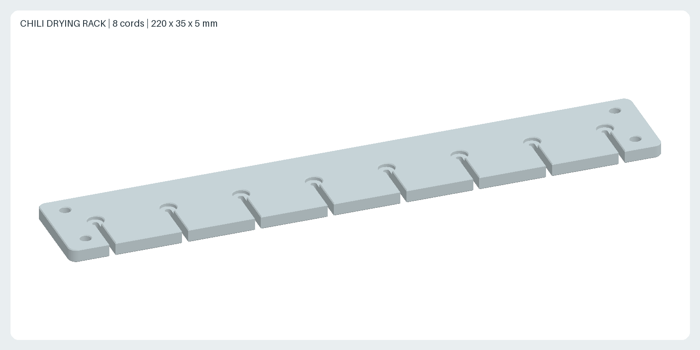
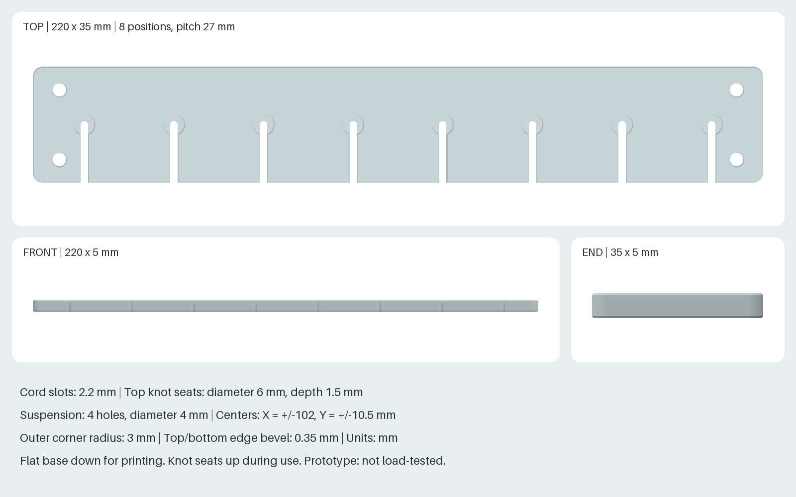

# 唐辛子乾燥用・8本掛けラック

PLAで平置き印刷する、紐吊り用のラックです。3個で24本、4個で32本を
吊るせます。実の長さは最大約100mmを想定します。実の幅が27mmに近い場合や
曲がった実が隣と触れる場合は、間を空けて掛けてください。




## ファイルと寸法

- `rack.stl`: 印刷用。1ファイル1部品、単位mm。
- `generate.py`: CadQuery生成コードと形状検査。
- `render.py`: STLから三面図・斜視図を再生成。
- 外形220 × 35 × 5mm、外周角R3mm、上下縁面取り0.35mm。
- 8か所、27mmピッチ。中心X座標は±13.5、±40.5、±67.5、±94.5mm。
- 紐用溝幅2.2mm。上面に直径6mm・深さ1.5mmの結び目受け。
- 四隅の吊り穴は直径4mm、中心座標(X,Y)=(±102,±10.5)mm。

## 印刷

PLA、0.4mmノズル、積層0.2mm、外周4周、上下各5層、充填20%以上を
初回試作の設定案とします。浅い丸い凹みが上、平らな底面が下です。
サポート不要の形状です。STLを縮尺100%で読み込んでください。
実際のプリンタの有効造形範囲とスライサー上の配置を確認してください。
機種固有のプロファイル・G-codeは同梱しません。

## 組み立てと使い方

1. バリを除去し、紐が触れる縁が滑らかか確認します。
2. 四隅の穴から4本の吊り紐を上方の吊り点へ結びます。
   板の上に150mm以上の高さを取って紐を集め、長さを調整して水平にします。
   紐と唐辛子が干渉しないようにします。
3. 唐辛子はヘタと可能なら20〜30mm程度の果柄を残して収穫します。
   実ごとの細い紐（直径約1〜1.5mm）を果柄へ結びます。
   まっすぐな果柄では抜けやすいため、持ち上げて抜けないことを確認します。
4. 紐の上端に直径4〜5mm程度の結び目を作ります。結び目は荷重で締まるため、
   引っ張った状態で溝より十分大きく、受けの直径6mmに収まることを確認します。
5. 結び目を板の上に置き、結び目の下の紐を前縁の溝から奥まで差し込みます。
   結び目を丸い受けに落とし込み、実を板の下へ吊ります。
   荷重は結び目と受け底で支えます。唐辛子のヘタを溝に掛ける構造ではありません。
6. 左右に偏らない順序で掛け、実同士や周囲に触れない間隔を確保します。
   取り外すときは実を支え、結び目を持ち上げて前縁へ紐を抜きます。

結び目受けはロック機構ではありません。強風や上下動で外れる可能性があるため、
風が強く当たらない場所で使い、移動時は板を水平に保ってください。
乾燥で果柄が細くなるため、結び直しが必要か毎日確認します。
PLAの変形を避け、雨の当たらない風通しのよい日陰で使用してください。
実を印刷部品に触れさせない配置とし、食品接触適合性は保証していません。

## 検証と制限

生成時に、有効な単一ソリッド、外形寸法、全8溝の開通、結び目受けの底、
全4吊り穴の開通を検査します。リポジトリの再生成チェックにSTLと両PNGを含めます。

実機印刷・荷重試験・屋外耐久試験は未実施です。許容荷重は未設定です。
最初は1個印刷し、落下しても支障のない低い位置で使用予定の紐と実による
抜け確認、水平の維持、たわみを確認してから必要数を追加してください。

## 再生成

リポジトリ直下で、ルートREADMEの固定環境を使います。

```sh
nix develop --command sh scripts/setup-env.sh
nix develop --command .venv/bin/python scripts/generate_all.py --check
```

## 設計の出所・ライセンス

2026-10-02の利用者指定（PLA、20〜30本、複数印刷可、実の長さ100mm以下、
収穫前、紐吊り方式）をもとに新規設計しました。他者のCADモデル、図面、
製品寸法は使用していません。形状と寸法は設計値であり、唐辛子の実測値ではありません。
描画には本リポジトリの既存STLレンダラーを再利用します。
ライセンスはリポジトリと同じCC BY-SA 4.0です。
