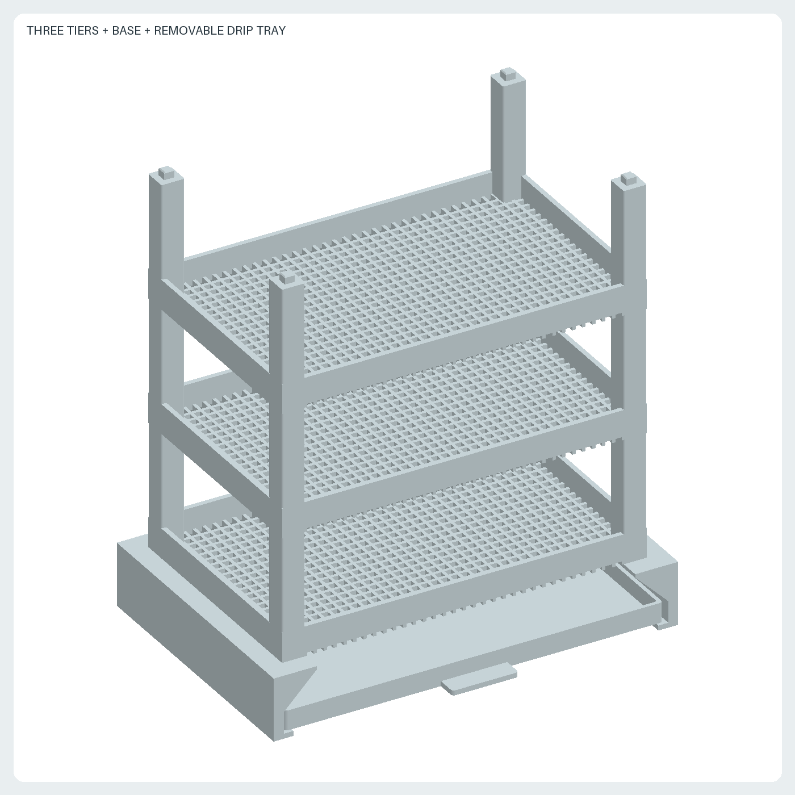
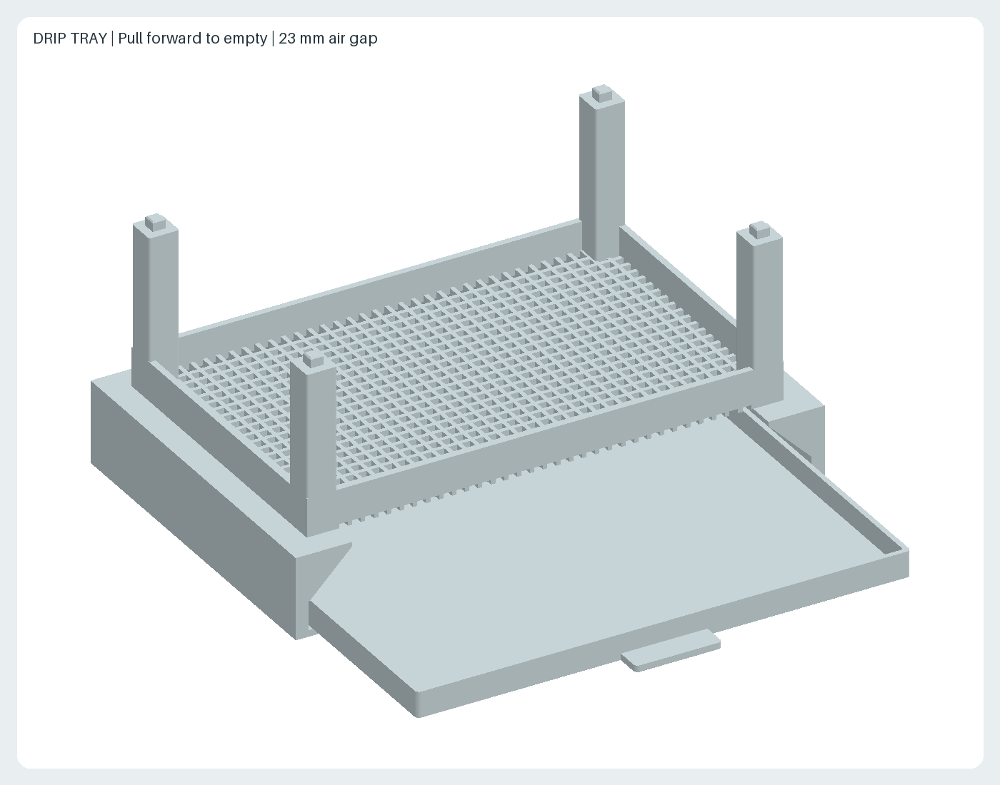
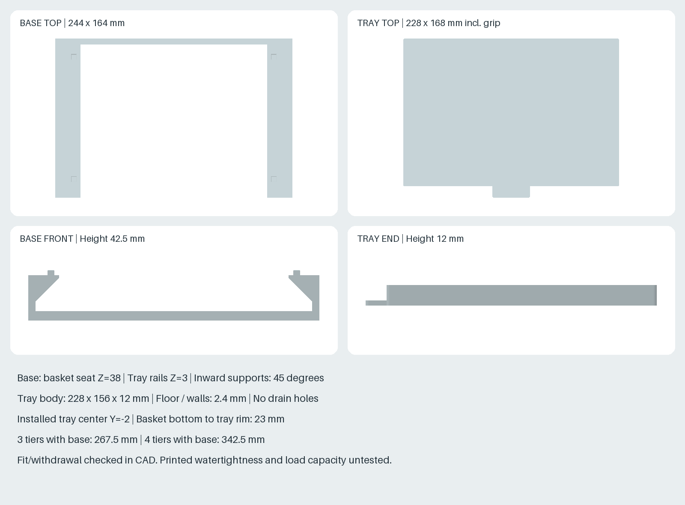

# 置き型・積み重ね式の唐辛子乾燥かご

受けかご・脚を兼ねる底面リブ・四隅の支柱・連結用の突起と穴を、一つの
印刷部品にまとめています。同じ `rack.stl` を必要数印刷し、積み重ねて使います。
最下段には `base.stl` の台座と、前から引き出せる `drip-tray.stl` の水受けを
各1個追加します。すべて印刷部品で、紐・ネジ・市販クリップは不要です。







## 仕様・構成

| 項目 | 設計値 |
| --- | --- |
| 単体外形 | 220 × 140 × 79.5mm |
| 3段 / 4段の高さ | 台座込み267.5mm / 342.5mm（かごのみ229.5mm / 304.5mm） |
| 積み重ねピッチ | 75mm |
| 目安容量 | 長さ100mm以下・幅約20mm以下の実を、1段に約8本 |
| 段数と本数 | 3段で約24本、4段で約32本。重なり具合に合わせて減らす |
| 中央の配置範囲 | 約192 × 112mm（四隅の支柱間を基準） |
| 底面の網目 | 中央部4 × 4mm、リブ幅2mm |
| 底面高さ / 縁の高さ | 床面から5mm / 18mm（かごの深さ13mm） |
| 底面の通風 | 前後に通じる高さ2mmの空気経路 |
| 段間の出し入れ開口 | 縁上端から上段下面まで57mm |
| 支柱 | 14 × 14mm、中心(X,Y)=(±103,±63)mm |
| 接続突起 | 6 × 6mm、高さ4.5mm、先端面取り0.6mm |
| 受け穴 | 6.8 × 6.8mm、深さ5mm、入口面取り0.4mm |
| はめあい余裕 | 片側0.4mm、先端と穴底の隙間0.5mm |

実を一層に並べる方式です。受けかごが乾燥面を兼ね、個別の吊り下げ保持は
ありません。網目より細い実や破片・種までは保持できません。
容量は実測ではなく配置の目安です。実同士が触れないように並べてください。

## 引き出し式の水受け

| 項目 | 設計値 |
| --- | --- |
| 台座 | 244 × 164 × 42.5mm（上の位置決め突起を含む） |
| かごの支持高さ | 床面から38mm |
| トレー本体 | 228 × 156 × 12mm |
| トレー外形 | 取っ手込み228 × 168 × 12mm |
| トレーの底・壁 | 厚さ2.4mm、排水穴なし |
| トレー内側開口 | 223.2 × 151.2mm、角R1mm |
| トレー支持高さ | 床面から3mm |
| 通風空間 | トレー縁の上端からかご底面まで23mm |
| 全体の設置範囲 | 幅244 × 奥行174mm（取っ手を含む） |

トレーを台座の左右の下側レールに載せ、奥の壁に当たるまで差し込みます。
かごを台座上の四つの突起に合わせて載せ、その上に残りのかごを積みます。
トレーだけを前へ引き出せるので、かごを動かさずに水を捨てられます。
水をこぼさないよう水平に引き出してください。前方には約180mmの取り出し空間が必要です。

台座は底を下に、トレーは開口を上にして印刷します。台座の内側の支持部は
45度の斜面で張り出す形状で、全幅を渡すブリッジはありません。
トレーは0.2mm積層なら底面12層相当です。水受けのため、底面が全層ソリッドに
なるよう上下層数を各6層以上にし、スライサーで確認してください。
トレー本体は底から印刷でき、サポート不要を想定しています。

印刷品の水密性は保証していません。使用前にシンクなどで少量の水を入れ、
底や壁から漏れないことを確認してください。漏れる場合は水受けとして使用せず、
印刷条件を見直してください。溜まった水はこまめに捨て、トレーを乾かします。
唐辛子は干す前に表面の水分を拭き取り、トレーに水を溜め続けない使い方とします。

## 印刷と組み立て

1. `rack.stl` を縮尺100%、底面リブが下、長い支柱が上の向きで配置します。
   STLは1ファイル1部品、単位mmです。220 × 140mmが有効造形範囲内に
   収まることをスライサーで確認してください。
2. PLA、0.4mmノズル、積層0.2mm、外周4周、上下各5層、充填20%以上を
   初回試作の設定案とします。まず1個で底面の短いブリッジを確認します。
3. サポートなしを想定しています。底面の縦リブは最初の層から造形し、
   横リブと前後の縁はZ=2mmから、約4〜5.5mmの隙間をブリッジします。
   底面の受け穴の天井も約6.8mmのブリッジです。スライサーで経路を確認してください。
4. 2個目を印刷し、四隅の突起を上段底面の穴に同時に合わせて載せます。
   支柱上面で荷重を受け、突起は横ずれを抑えます。無理に押し込まず、
   バリ・初層の膨らみ・寸法誤差を確認してください。
5. はめあいが確認できてから、残りを印刷します。印刷誤差が大きい場合は
   生成コードの `SOCKET_WIDTH` を調整して再生成してください。

上下の接続は位置決め用で、引き抜きをロックしません。上段を持って全体を
持ち上げず、移動時は段ごとに分けてください。平らで安定した台へ置きます。
設計上は3〜4段を想定していますが、実機の耐荷重・転倒試験は未実施です。

## 使用条件

- 風通しのよい日陰で使用し、雨とPLAが変形する高温を避けます。
- 底面の前後に空間を残し、下の空気経路を塞がないようにします。
- 実を重ねず、接触面が偏らないように適宜裏返します。
- 本設計は実が印刷面に直接触れます。手持ちPLAの食品接触への適合性は未確認です。
  フィラメントと印刷条件の適合性を確認してから食品用途に使用してください。
- 洗浄後は十分に乾かします。PLAのため熱湯や食洗機での洗浄は想定しません。

## ファイルと再生成

- `rack.stl`: 置き型かご単体。旧版の紐吊りラックを置き換えています。
- `base.stl`: かごを38mm持ち上げ、水受けのレールを備える台座。1個使用。
- `drip-tray.stl`: 水受けトレー。1個使用。
- `generate.py`: CadQueryモデル、形状・積み重ね干渉の検査。
- `render.py`: 実際のSTLから三面図・単体斜視図・3段組立図を生成。
- `views.png`, `preview.png`, `assembly.png`: かごの図面と台座付き組立図。
- `drawer.png`, `accessories.png`: 引き出し状態と台座・水受けの寸法図。

リポジトリ直下で、ルートREADMEに記載した固定環境を使います。

```sh
nix develop --command sh scripts/setup-env.sh
nix develop --command .venv/bin/python scripts/generate_all.py --check
```

生成時に単一ソリッド、外形寸法、代表位置の網目と通風経路、支柱の突起と
受け穴、2段を積み重ねた際の体積干渉がないことを検査します。
台座・トレーも単一ソリッドと外形を検査し、台座とかごの接続、水受けによる
かご投影範囲の包含、トレー引き出し全経路の干渉を検査します。
STLは計算誤差の微小な揺れを小数6桁に正規化し、全PNGとともに再生成一致を
CIで検査します。実機印刷、接続部の公差、荷重、転倒、水密性、屋外耐久は未検証です。
許容荷重は未設定です。

## 設計の出所・ライセンス

2026-10-02の利用者指定（PLA、20〜30本、複数印刷可、実の長さ100mm以下、
受けかご、連結、市販の追加部材不要、置き型、取り外せる水受け）から新規設計しました。
他者のCADモデル・図面・製品寸法は使用していません。寸法は設計値です。
描画は本リポジトリの既存STLレンダラーを再利用します。
ライセンスはリポジトリと同じCC BY-SA 4.0です。
