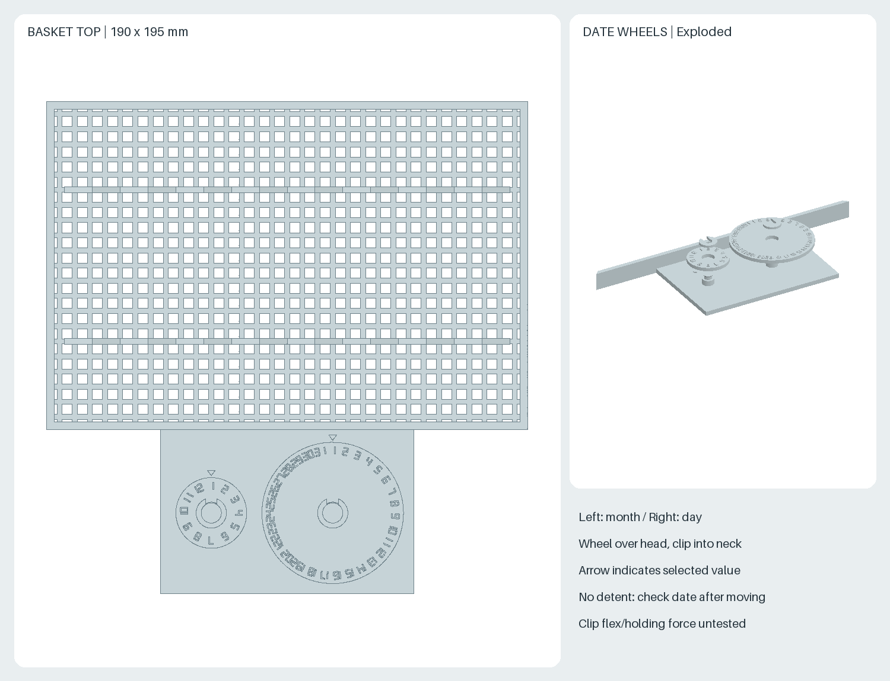

# 引き出し式・積み重ね式の唐辛子乾燥かご

段を外さずに取り出せる乾燥かご、実を並べる8列のV字受け、収穫月日を示す
回転ダイヤルを備えます。最下段には独立した引き出し式の水受けを置きます。
すべて印刷部品で、金属ねじ・紐・市販クリップは不要です。
**組み立ては必要です。全体を一体で印刷する設計ではありません。**





## ネットに対して狙った利点

- 収穫分を段ごとに分け、上の段を動かさず確認・取り出しできます。
- 22mm間隔の8列に並べ、実の重なりを抑えます。前後2か所の浅いV字受けが
  実を支え、底面との接触を減らす狙いです。曲がった実などは底面にも触れます。
- 各かごに月・日の表示を付け、収穫日を記録できます。
- 乾燥かごと水受けを個別に取り外して洗えます。

乾燥時間の短縮や防カビ効果は測定していません。防虫性はなく、防虫ネットの
代わりにはなりません。実は適宜裏返し、形・太さに応じて本数を減らします。

## 構成と印刷数

| ファイル | 1段あたり | 3段構成 | 用途 |
| --- | ---: | ---: | --- |
| `rack.stl` | 1 | 3 | 積み重ねフレーム、左右レール、奥のストッパー |
| `basket.stl` | 1 | 3 | 網底、V字受け、日付台・軸を一体化した引き出し |
| `month-dial.stl` | 1 | 3 | 1〜12の月表示 |
| `day-dial.stl` | 1 | 3 | 1〜31の日表示 |
| `dial-clip.stl` | 2 | 6 | ダイヤル軸の抜け止め用C形クリップ |
| `base.stl` | — | 1 | 最下段の台座 |
| `drip-tray.stl` | — | 1 | 水受け |

3段は20部品、4段は26部品です。小物は同じプレートに複数配置できます。
旧版の `rack.stl` は一体かごでしたが、今回から引き出し用フレームに変わります。
台座・水受けと四隅の積み重ね接続寸法は従来版と共通です。

## 寸法

単位mm。すべて設計値です。

| 項目 | 設計値 |
| --- | --- |
| フレーム | 220 × 140 × 79.5 |
| 乾燥かご | 本体190 × 130 × 12、日付台込み190 × 195 × 12 |
| 組立済み1段の外形 | 220 × 198 × 79.5 |
| 全体の設置範囲 | 台座・日付台込み244 × 210 |
| 3段 / 4段の高さ | 台座込み267.5 / 342.5 |
| 積み重ねピッチ | 75 |
| 目安容量 | 長さ100以下・幅約20以下を1段約8本、3段約24本・4段約32本 |
| かご内側 | 184 × 124 |
| 網目 | 中央部4 × 4、リブ幅2、厚さ3 |
| V字受け | 8列、22ピッチ、支持位置Y=±30、幅2.4 |
| V字高さ | かご底から谷4.5 / 山9（網底上から谷1.5 / 山6） |
| レール上端 / かご縁上端 | フレーム底から5 / 17 |
| レールの支持幅 | 片側3（X=92〜95） |
| 支柱間の横隙間 | 片側1 |
| 支柱 | 14 × 14、中心(X,Y)=(±103,±63) |
| 接続突起 / 受け穴 | 6 × 6 × 高さ4.5 / 6.8 × 6.8 × 深さ5 |
| 接続余裕 | 片側0.4、先端0.5 |
| 月 / 日ダイヤル | 直径28 / 56、板厚2.4、数字の浮き出し0.6 |
| ダイヤル軸 / 穴 | 直径8 / 8.6 |
| C形クリップ | 最大12 × 約11.5 × 1.6、内径5.4、口幅4.6 |

100mmの実を長手方向に並べる目安です。細い実・破片・種は網目から落ちます。
V字受けは個別のクランプではなく、太さや曲がりによって隣の列にはみ出すことがあります。

## 印刷と組み立て

PLA、0.4mmノズル、積層0.2mm、外周4周、上下各5層、充填20%以上を
初回試作の設定案とします。STLは1ファイル1部品・mm・縮尺100%です。
各部品はA2Lの公称造形範囲330 × 320 × 325mm内に収まります。
複数部品を配置する際はブリムなどを含め、スライサーで確認してください。

1. すべてSTLの底面を下に配置します。かご・水受けは開口を上に、ダイヤルは
   数字を上に、C形クリップは平置きです。サポートなしを想定しています。
   フレーム底のソケット天井は6.8mmのブリッジ、軸頭の下面は45度です。
   実際のスライスと印刷は未実施のため、造形経路を確認してください。
2. まず1段とダイヤル・クリップを印刷します。軸にダイヤルを上から通し、
   軸の細い首へC形クリップを横から差し込みます。左が月、右が日です。
   クリップは首径5に対し口幅4.6で、通過時に片側約0.2開く設計です。
   PLAでの弾性・割れ・保持力は未検証です。無理に押さず、まず小物で試してください。
3. 日付台の矢印に数字を合わせます。ダイヤルは連続回転式で、クリックや
   ロックはありません。引き出し操作後に日付がずれていないか確認します。
   回転・軸方向の余裕を設けており、摩擦保持力は保証していません。
4. フレームの開いた側からかごを左右のレールに載せ、奥の壁まで差し込みます。
   取っ手を持って引き出し、途中から底をもう片方の手で支えます。
   **引き出しの抜け止めはありません。引き出したまま手を離さないでください。**
   約200mmの前方取り出し空間を確保し、1段ずつ操作します。
5. 台座に水受けを差し込み、四つの突起にフレームを載せて積み重ねます。
   はめあいと安定性を確認後に残りの段を印刷します。ソケットの調整箇所は
   `generate.py` の `SOCKET_WIDTH` です。

積み重ね接続は位置決め用で、引き抜きをロックしません。上段を持って全体を
持ち上げず、移動時は段ごとに分けます。水平な安定した台へ置いてください。
耐荷重・転倒・引き出し時の安定性は未試験で、許容荷重は未設定です。

## 引き出し式の水受け

| 項目 | 設計値（mm） |
| --- | --- |
| 台座 | 244 × 164 × 42.5（位置決め突起込み） |
| フレーム支持高さ | 床面から38 |
| 水受け | 本体228 × 156 × 12、取っ手込み228 × 168 × 12 |
| 水受け底・壁 / 内側開口 | 厚さ2.4 / 223.2 × 151.2、角R1 |
| 水受け支持高さ | 床面から3 |
| 通風空間 | 水受け縁からフレーム底まで23、乾燥かご底まで28 |

水受けは乾燥かご本体の真下を覆います。日付台は水受けより前へ張り出すため、
**実を日付台に置かないでください。** 引き出し中のかご全体の滴は受けられません。
水受けだけを水平に前へ引き出して水を捨て、乾かせます。水を溜め続けず、
唐辛子は干す前に表面の水分を拭き取ります。

台座の内側支持は45度の斜面です。水受けは底厚2.4mmなので0.2mm積層なら
上下各6層以上とし、底が全層ソリッドになることを確認してください。
印刷品の水密性は未検証です。シンクなどで少量の水を入れて漏れを確認し、
漏れる場合は印刷条件を見直してください。

## 使用条件

- 風通しのよい日陰で使用し、雨・高温を避けます。
- 実を重ねず、接触面が偏らないように適宜裏返します。
- 実は印刷面に直接触れます。手持ちPLAと印刷条件の食品接触への適合性は未確認です。
  食品用途への適合性を確認してから使用してください。
- 洗浄後は十分に乾かします。PLAのため熱湯や食洗機は想定しません。

## 再生成と検証

ルートREADMEの固定環境を使用します。

```sh
nix develop --command sh scripts/setup-env.sh
nix develop --command .venv/bin/python scripts/generate_all.py --check
```

`generate.py` が全7種類のSTLを生成し、単一ソリッド、外形、積み重ね・台座の
干渉、乾燥かごと水受けそれぞれの連続した引き出し経路、網目とV字受け、
ダイヤルの回転包絡と装着済みクリップの干渉を検査します。
クリップを差し込むときの弾性変形はこの剛体CAD検査の対象外です。
数字はフォント依存を避けた7セグメント形状です。

`render.py` は出力済みSTLを使い、三面図・組立図・引き出し図・詳細図を生成します。
STLの浮動小数点座標は小数6桁に正規化します。全STL/PNGの再生成一致をCIで
検査します。これらは寸法・再現性の検査で、実機の造形性・公差・荷重・転倒・
水密性・乾燥性能の検証ではありません。

## 設計の出所・ライセンス

利用者指定のPLA、20〜30本、長さ100mm以下、置き型、積み重ね、印刷部品のみ、
水受け、引き出し、収穫日表示、実の接触を減らす受けから新規設計しました。
他者のCAD・図面・製品寸法は使用していません。描画は既存の本リポジトリの
STLレンダラーを再利用します。ライセンスはCC BY-SA 4.0です。
