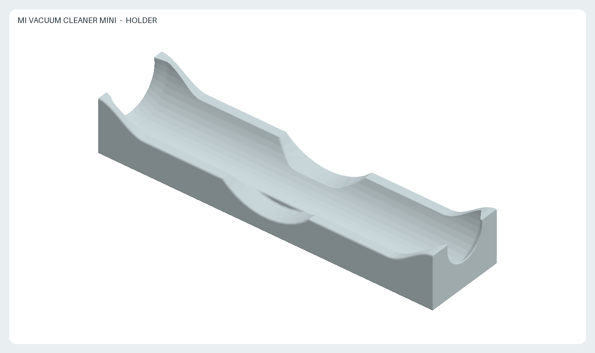
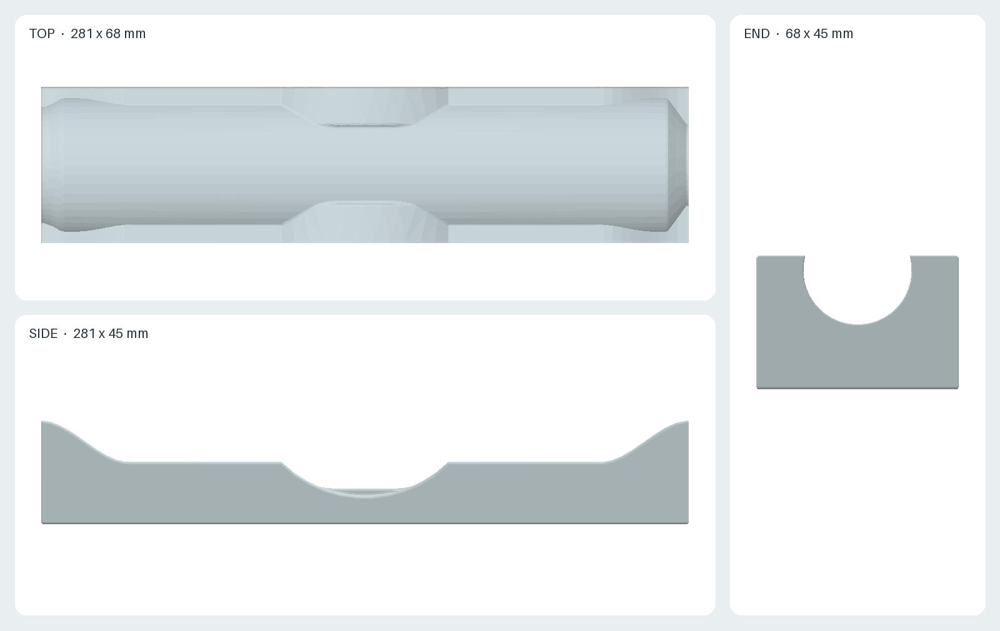

# Mi Vacuum Cleaner Mini holder

A horizontal cradle for Mi Vacuum Cleaner Mini (SSXCQ01XY). The two ends of
the semicircular cradle rise gradually to resist sliding along the body. The
front remains open for an attached nozzle, and the rear remains open for the
USB-C charging cable. Rounded side cutouts at the middle provide a handhold.

- [`holder.stl`](holder.stl): one printable part, 281 × 68 × 45 mm.
- [`generate.py`](generate.py): parametric CadQuery source, dimensions in mm.
- [`views.png`](views.png): orthographic top, side, and end views.
- [`preview.png`](preview.png): rendered 3D view of the exported STL.
- [`render.py`](render.py): deterministic offline rendering script.

## Sources and design assumptions

- [Xiaomi official specifications](https://www.mi.com/sg/product/mi-vacuum-cleaner-mini/specs/):
  main unit dimensions **267 × 55 × 55 mm**. The 55 mm width was treated as
  the nominal circular body diameter; the source does not provide a detailed
  profile or tolerances.
- [Xiaomi official user manual](https://i01.appmifile.com/webfile/globalimg/Global_UG/Mi_Ecosystem/Mi_Vacuum_Cleaner_mini/Vacuum_Cleaner_Mini_All_V1.pdf),
  product overview (printed page 4) and specifications (printed page 9):
  model **SSXCQ01XY**, nozzle at the front and Type-C charging port at the
  rear. The manual illustrates nozzle installation on printed page 6.
- The **281 × 68 × 45 mm** stand, **1.5 mm radial body clearance**, **50 mm
  front opening**, and **36 mm rear opening** are design choices, not published
  Xiaomi dimensions. No physical measurements were taken of the body, either
  nozzle, the USB-C plug, or their insertion clearances. The clearances and
  fit require a physical check before relying on the printed part.

Print with the flat underside on the bed. Check that the model fits the build
area before slicing. The end openings are 50 mm at the nozzle side and 36 mm
at the USB-C side before edge rounding. The design uses the manufacturer's
nominal body dimensions of 267 × 55 × 55 mm; the nozzle and plug clearances
and actual fit have not been verified on a physical unit.

The STL was generated with Python 3.12 and CadQuery 2.7.0; the images use
NumPy 2.3.5 and Pillow 12.3.0. Use the pinned Nix and container commands in
the [repository README](../README.md) to regenerate and check all outputs.
After changing the geometry, inspect the result and verify that it is a valid,
single closed solid before printing.

License: [CC BY-SA 4.0](../LICENSE.md). This is an independent accessory and
is not an official Xiaomi product.
