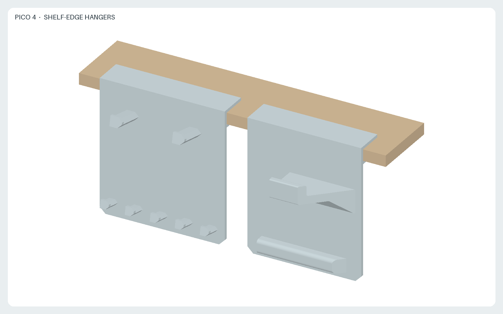
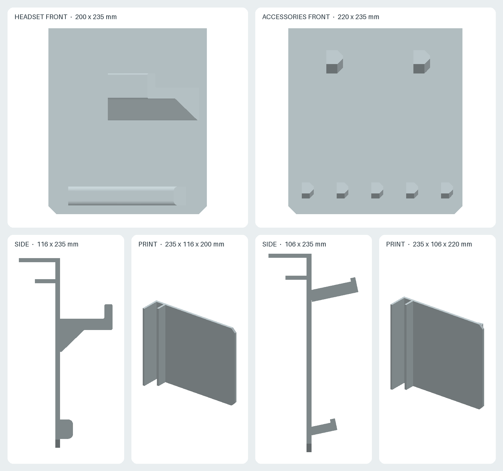

# PICO 4 shelf-edge hangers

Two independent panels that hang from the front edge of a shelf board. Each panel clamps the board with a C-shaped hook, so no screws or adhesive are needed, and every item is removed by lifting it off.

- [`headset.stl`](headset.stl): headset module, 200 × 116 × 235 mm (width × depth × height). The arm passes through the strap ring and carries the rear battery pack; its raised tip keeps the strap from sliding off. The headset hangs below the arm and the visor leans on the rib near the bottom of the panel, which stops it from swinging.
- [`accessories.stl`](accessories.stl): accessory module, 220 × 106 × 235 mm. Two pegs hold the controllers by their tracking rings. Five shorter pegs below them hold PICO Motion Trackers by their straps. All pegs rise 12° toward the tip and end in a small stop.
- [`generate.py`](generate.py): parametric CadQuery source, dimensions in mm.
- [`views.png`](views.png): front and side views in use, and each part in print orientation.
- [`preview.png`](preview.png): both modules on a 20 mm shelf board.
- [`render.py`](render.py): deterministic offline rendering script.

## Fitting to the shelf

The clamp gap is 21 mm (`SHELF_GAP`), for boards 18–20 mm thick. The top leg rests 45 mm deep on the shelf, and a 25 mm lip under the board stops the panel from lifting when an item is pulled upward. For a thinner board, reduce `SHELF_GAP` in `generate.py` and regenerate; a gap more than about 2 mm wider than the board lets the panel tilt forward.

The space below the shelf must be free to about 235 mm below the shelf top for the panels, plus the length of the hanging items: the headset visor and the tracker straps hang below the panels.

## Printing

Each module is exported lying on its left end, so the clamp and the panel print as vertical walls, and the layers run along the pegs and the arm. The arm, the rib and the pegs are shaped so that no face is steeper than 45° from vertical, apart from seven 4 × 6 mm bridges under the peg stops. `generate.py` checks this and stops if any other face needs support. The arm is therefore wider at its root on one side. The parts are 200 mm and 220 mm tall in print orientation; check the build volume and use a brim, because the parts are tall relative to their footprint. PETG is suggested for its resistance to creep under constant load.

## Sources and design assumptions

- [PICO 4 product specifications](https://www.picoxr.com/global/products/pico4/specs): the page lists no dimensions. The 5300 mAh battery is at the rear of the strap.
- [PICO 4 Enterprise specifications](https://www.picoxr.com/global/products/pico4e/specs): **255–310 mm (length) × 195 mm (width) × 106 mm (height)**, **591 g (300 g without straps)**. This is a related model with the same form factor; the values are used as estimates for PICO 4.
- [PICO 4 Ultra product page](https://www.picoxr.com/global/products/pico4-ultra): the PICO 4 controller is **approximately 134.7 mm** tall.
- [PICO Motion Tracker specifications](https://www.picoxr.com/global/products/pico-motion-tracker/specs): approximately **27 g** per tracker including the socket. The dimensions are published only as images and are not used here.

The following are design choices, not published PICO dimensions, and have not been checked on physical units:

- The arm top is 70 mm below the shelf top so that the battery pack clears the underside of the board. The arm reaches 65 mm from the panel; its full length is 50 mm wide.
- The rib is 16 mm deep and lies 195–219 mm below the shelf top. Whether the visor leans on it depends on the strap length setting and on how far out the battery pack sits on the arm.
- Controller pegs: 14 mm wide, 55 mm long, 110 mm apart. This assumes that the opening of the tracking ring is larger than the peg and that the two controllers, hanging side by side, do not touch.
- Tracker pegs: 10 mm wide, 30 mm long, 44 mm apart. This assumes each tracker is narrower than 44 mm and is stored with its strap attached; a tracker without a strap cannot be hung.

Print one module first and check the fit of the clamp, the strap ring on the arm, the controller rings and the tracker straps before printing the other.

The STLs were generated with Python 3.12 and CadQuery 2.7.0; the images use NumPy 2.3.5 and Pillow 12.3.0. Use the pinned Nix and container commands in the [repository README](../README.md) to regenerate and check all outputs.

License: [CC BY-SA 4.0](../LICENSE.md). This is an independent accessory and is not an official PICO product. PICO is a trademark of its owner and is used here only to identify compatible devices.
