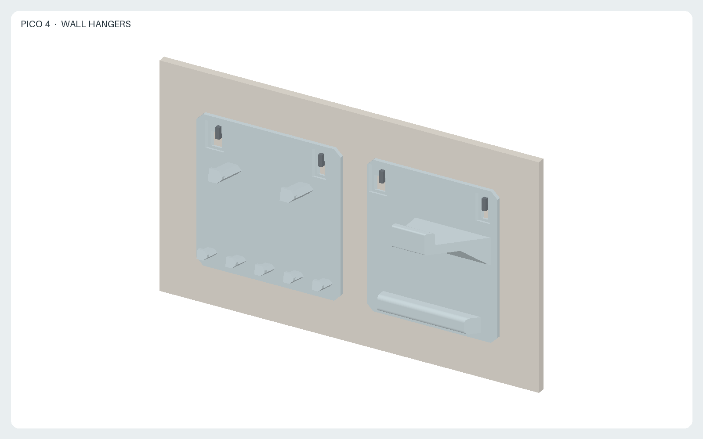
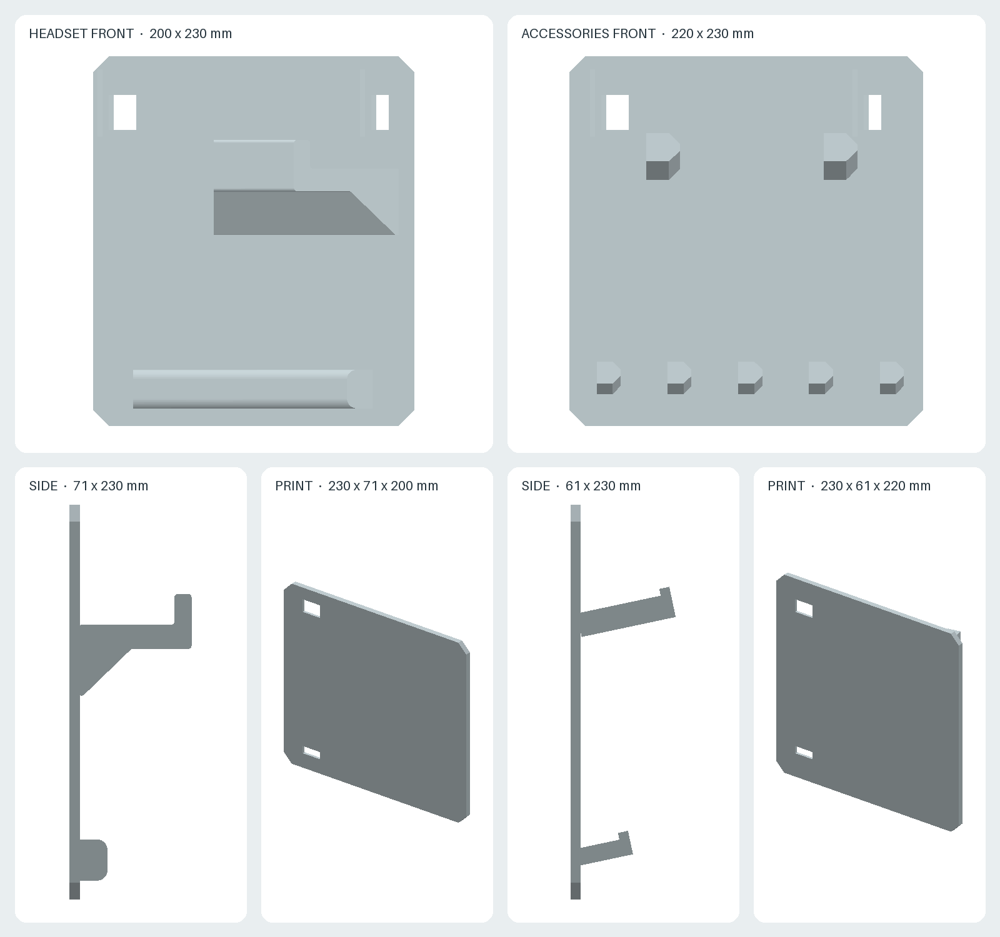

# PICO 4 wall hangers

Two independent panels that hang on L- or J-shaped wall hooks, two hooks per panel. Every item is removed by lifting it off, and each panel is removed by lifting it off its hooks.

- [`headset.stl`](headset.stl): headset module, 200 × 71 × 230 mm (width × depth × height). The arm passes through the strap ring and carries the rear battery pack; its raised tip keeps the strap from sliding off. The headset hangs below the arm and the visor leans on the rib near the bottom of the panel, which stops it from swinging.
- [`accessories.stl`](accessories.stl): accessory module, 220 × 61 × 230 mm. Two pegs hold the controllers by their tracking rings. Five shorter pegs below them hold PICO Motion Trackers by their straps. All pegs rise 12° toward the tip and end in a small stop.
- [`generate.py`](generate.py): parametric CadQuery source, dimensions in mm.
- [`views.png`](views.png): front and side views in use, and each part in print orientation.
- [`preview.png`](preview.png): both modules on a wall, with schematic hooks.
- [`render.py`](render.py): deterministic offline rendering script.

## Hooks and mounting

Each panel has two vertical slots near its top edge, 160 mm apart centre to centre (`HOOK_SPACING`). To hang a panel, pass the up-turned tips of both hooks through the slots, then let the panel drop until the upper edges of the slots rest on the hook shanks. The panel's back face lies flat against the wall, and the load of the items presses its lower part against the wall.

Install the two hooks for each panel at the same height, 160 mm apart. The top edge of the panel ends 24 mm above the top of the hook shanks. Both panels use the same slot layout, so the same hook spacing applies to both.

Requirements for the hooks, based on 5–6 mm thick hooks with a shank of 6–10 mm from the wall to the bend:

- Around each slot the panel is 3 mm thick (`SLOT_WEB`), thinned from the front. The straight part of the shank, from the wall to the inside of the bend, must be longer than 3 mm. The hook tip sits in the recess in front of the slot.
- The slots are 22 mm tall (`SLOT_HEIGHT`). The up-turned tip may rise at most about 15 mm above the top of a 6 mm shank to pass through.
- One slot is 8 mm wide and locates the panel; the other is 14 mm wide and absorbs an error of up to about ±4 mm in the hook spacing with 6 mm hooks.
- The hooks carry the panel and its contents: about 0.6 kg for the headset module with the headset, plus the panel weight. Choose hooks rated for this load in the wall material.

## Printing

Each module is exported lying on one end, so the layers run along the pegs and the arm, which are loaded in bending. The arm, the rib, the pegs, the slots and their recesses are shaped so that no face is steeper than 45° from vertical, apart from seven 4 × 6 mm bridges under the peg stops. `generate.py` checks this and stops if any other face needs support. For this reason the arm is wider at its root on one side, and one side wall of each slot slopes toward the front. The parts are 200 mm and 220 mm tall in print orientation; check the build volume and use a brim, because the parts are tall relative to their footprint. PETG is suggested for its resistance to creep under constant load.

## Sources and design assumptions

- [PICO 4 product specifications](https://www.picoxr.com/global/products/pico4/specs): the page lists no dimensions. The 5300 mAh battery is at the rear of the strap.
- [PICO 4 Enterprise specifications](https://www.picoxr.com/global/products/pico4e/specs): **255–310 mm (length) × 195 mm (width) × 106 mm (height)**, **591 g (300 g without straps)**. This is a related model with the same form factor; the values are used as estimates for PICO 4.
- [PICO 4 Ultra product page](https://www.picoxr.com/global/products/pico4-ultra): the PICO 4 controller is **approximately 134.7 mm** tall.
- [PICO Motion Tracker specifications](https://www.picoxr.com/global/products/pico-motion-tracker/specs): approximately **27 g** per tracker including the socket. The dimensions are published only as images and are not used here.

The following are design choices, not published PICO dimensions, and have not been checked on physical units:

- The arm top is 70 mm below the panel top edge, which leaves room above the arm for the battery pack. The arm reaches 65 mm from the panel; its full length is 50 mm wide.
- The rib is 16 mm deep and lies 195–219 mm below the panel top edge. Whether the visor leans on it depends on the strap length setting and on how far out the battery pack sits on the arm.
- Controller pegs: 14 mm wide, 55 mm long, 110 mm apart, 70 mm below the panel top edge. This assumes that the opening of the tracking ring is larger than the peg and that the two controllers, hanging side by side, do not touch.
- Tracker pegs: 10 mm wide, 30 mm long, 44 mm apart. This assumes each tracker is narrower than 44 mm and is stored with its strap attached; a tracker without a strap cannot be hung.

Print one module first and check the fit on the hooks, the strap ring on the arm, the controller rings and the tracker straps before printing the other.

The STLs were generated with Python 3.12 and CadQuery 2.7.0; the images use NumPy 2.3.5 and Pillow 12.3.0. Use the pinned Nix and container commands in the [repository README](../README.md) to regenerate and check all outputs.

License: [CC BY-SA 4.0](../LICENSE.md). This is an independent accessory and is not an official PICO product. PICO is a trademark of its owner and is used here only to identify compatible devices.
