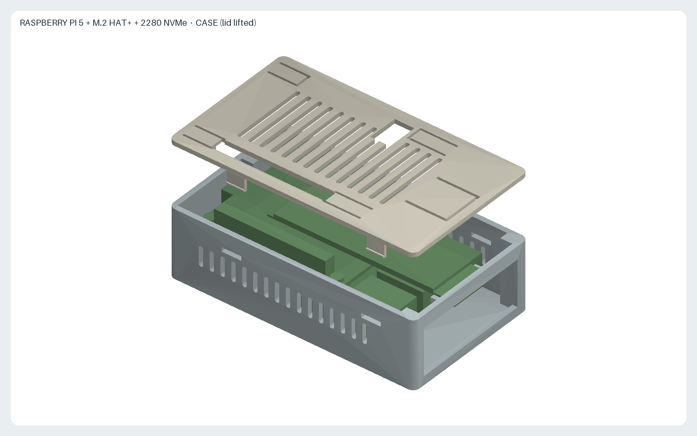
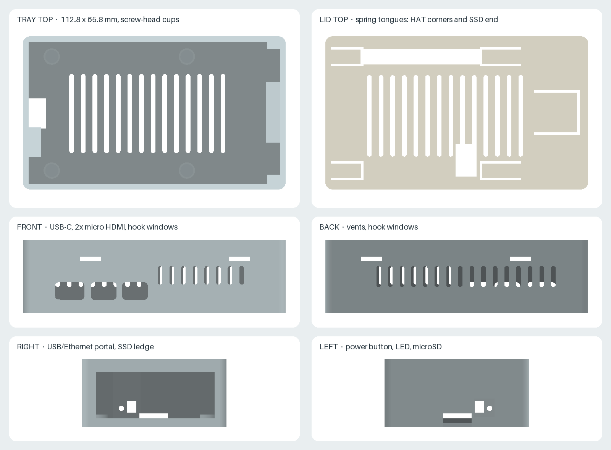
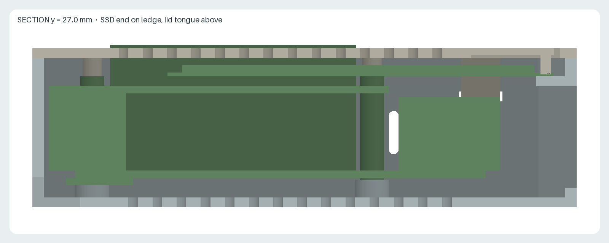

# Raspberry Pi 5 NVMe case

A two-part, passively ventilated case for Raspberry Pi 5 with the Raspberry Pi M.2 HAT+ (standard variant) and an M.2 2280 NVMe SSD. The case needs no screws beyond those supplied with the M.2 HAT+: the boards sit in four cups on the tray floor, and the lid snaps on, pressing the boards down with spring tongues. All external ports, the power button, the status LED and the microSD slot remain accessible.

Status: prototype. The geometry has been checked against simplified keep-out volumes only; it has not been printed or fitted.

- [`tray.stl`](tray.stl): 112.8 × 65.8 × 31.0 mm, printed floor down.
- [`lid.stl`](lid.stl): 112.8 × 65.8 × 10.3 mm including the snap hooks, exported upside down in its printing orientation.
- [`reference-assembly.stl`](reference-assembly.stl): simplified keep-out volumes of the boards and SSD used for checks and images; not for printing.
- [`generate.py`](generate.py): parametric CadQuery source and clearance checks, dimensions in mm.
- [`render.py`](render.py): deterministic offline rendering of the images below.

## 2280 SSD on the M.2 HAT+

The M.2 HAT+ officially supports 2230 and 2242 devices only. A 2280 drive inserted into its connector extends about 38 mm beyond the 2242 mounting position, past the HAT edge and above the USB/Ethernet ports. This configuration is outside the manufacturer's specification.

- The tray's right wall is moved out to x = 101.5 mm, and a 2 mm ledge on it carries the drive end. The ledge top is 0.3 mm below the estimated drive underside.
- A spring tongue cut into the lid presses the drive end onto the ledge with an estimated 0.4 mm preload. The drive is not screwed at its end. Leave the HAT's knurled 2242 screw out; it would lift the 2280 drive at that position.
- Below the ledge, the right wall is a single open portal for the USB and Ethernet plugs. Plug overmolds may extend up to 2.2 mm above the upper USB receptacles.

## Screwless retention

- **Board location**: the heads of the four M.2 HAT+ kit screws under the Pi sit in Ø5.6 mm cups on the tray floor. The cups locate the stack sideways; the Pi PCB stays 0.3 mm above the cup rims, so only the screw heads carry load.
- **Board clamping**: four spring tongues in the lid press on the kit screw heads above the HAT corners with a 0.5 mm nominal preload (about 3 to 7 N each, estimated for PLA). The force passes through the spacers, so neither board is bent.
- **Lid**: four snap hooks, two on each long side, latch into 9 × 2 mm windows in the walls. The calculated peak strain of the hook arms while snapping is 1.5 %. To open, push each hook nub inward through its window with a fingernail or a small flat screwdriver and lift the lid.
- **Tolerance**: the clamp preload depends on the kit screw-head height (`SCREW_HEAD_HEIGHT`, assumed 2.0 mm) and the stack heights. The tongues absorb roughly ±0.5 mm. The lid can lift by up to 0.1 mm against the hooks, which reduces both preloads by that amount.
- **PLA creep**: PLA relaxes under constant stress at 40 to 50 °C. The tongue preload and hook engagement may loosen over time in a warm case. If the boards become loose, print the lid in PETG.

## Hardware

- Raspberry Pi 5, M.2 HAT+ with its 16 mm stacking header and spacers, and an M.2 2280 M key NVMe SSD.
- The spacer screws supplied with the M.2 HAT+, above and below the stack. Heads up to Ø5.0 mm and 2.0 mm high fit the cups and the lid tongues.
- 4 × adhesive rubber feet, Ø10 mm and at least 3 mm tall, in the 0.6 mm recesses. They provide the gap for the floor intake vents.

## Assembly

1. Assemble the Pi, the HAT, the PCIe ribbon cable and the SSD outside the case, following the M.2 HAT+ instructions, but without the knurled drive screw.
2. Lower the assembly vertically into the tray until the lower screw heads drop into the floor cups. The microSD card, power button and ribbon-cable loop pass the left wall; the SSD end lands on the right ledge.
3. Fit the lid and press it down until all four hooks click into their windows. The GPIO stacking header passes through the rear slot, and the camera/display FFC can leave through the slot above the HAT notch.

## Printing

- Material as requested: PLA. Layer height 0.2 mm, 3 walls.
- Tray: floor on the bed. The lintel above the right portal is a 54 mm bridge. The SSD ledge is a 6 mm overhang from that bridge; enable support for the ledge only (painted or enforced support in the slicer) and remove it through the portal.
- Lid: top face on the bed, as exported. No support. The hook arms stand 8.3 mm tall; print them with at least 3 walls so that they are solid.

## Cooling and material limits

There is no heatsink and no fan. Air enters through the floor slots and the side slots and leaves through the lid slots and the portal. Under sustained CPU load the SoC will reach its throttling temperature; this case is intended for light or intermittent loads such as a NAS or a small server. PLA softens at about 55 to 60 °C. Do not use the case in a closed cabinet, in direct sunlight or above other heat sources. If the inside temperature is a concern, print the same files in PETG or ASA.

## Sources and design assumptions

- [Raspberry Pi 5 mechanical drawing](https://datasheets.raspberrypi.com/rpi5/raspberry-pi-5-mechanical-drawing.pdf): 85 × 56 mm board, 58 × 49 mm M2.5 hole pattern 3.5 mm from the edges, USB-C at 11.2 mm, micro HDMI at 25.8 and 39.2 mm, Ethernet at 10.2 mm, USB at 29.1 and 47 mm, ports overhanging 3 mm, power button at 18.4 mm and status LED at 13.3 mm on the short edge.
- [M.2 HAT+ product brief](https://datasheets.raspberrypi.com/m2-hat-plus/raspberry-pi-m2-hat-plus-product-brief.pdf) (September 2025): supported form factors 2230/2242, 16 mm stacking header and spacers, 65 × 56.5 mm outline, FFC connector recess on the short edge and the 10 × 16.5 mm notch.
- [HAT+ specification](https://datasheets.raspberrypi.com/hat/hat-plus-specification.pdf): 16 mm board-to-board spacers are recommended; the case uses 16 mm.

Values read off the drawings or assumed, which must be checked on the physical parts before printing (constants in `generate.py`):

| Constant | Value | Basis |
| --- | --- | --- |
| `PCB_THICKNESS` | 1.6 mm | assumed for both boards |
| `USB_TOP_ABOVE_PCB` | 15.3 mm | scaled from the side view |
| `M2_CARD_STANDOFF` | 2.25 mm | assumed connector height from HAT top to SSD underside |
| `M2_2242_END_X` | 61.1 mm | scaled from the HAT drawing; the 2280 end follows at 99.1 mm |
| `M2_CARD_Y` | 17.5 to 39.5 mm | scaled from the HAT drawing |
| `MICROSD_Y` | 22.5 to 33.5 mm | scaled from the top view |
| `GPIO_HEADER_X` | 7.2 to 58.2 mm | header body, scaled from the top view |
| `SCREW_HEAD_HEIGHT` | 2.0 mm | assumed for the HAT kit screws; sets the cup depth and clamp preload |
| ribbon-cable loop | to x = −5.5 mm | estimated from the product photograph |

`generate.py` refuses to export if any keep-out volume (boards, ports, ribbon-cable loop, GPIO header, SSD, spacers and the assumed cable plugs) intersects the tray or lid, if any board volume cannot be lowered vertically into the tray, if the lid intersects the tray, if a hook arm bent inward while snapping would hit the boards, if the hook strain exceeds 2 %, or if a tongue preload differs from the intended value. If a measurement differs, change the constant, regenerate, and inspect the images.

The STL files were generated with Python 3.12 and CadQuery 2.7.0; the images use NumPy 2.3.5 and Pillow 12.3.0. Use the pinned Nix and container commands in the [repository README](../README.md) to regenerate and check all outputs.

License: [CC BY-SA 4.0](../LICENSE.md). This is an independent accessory and is not an official Raspberry Pi product. Raspberry Pi is a trademark of Raspberry Pi Ltd.
