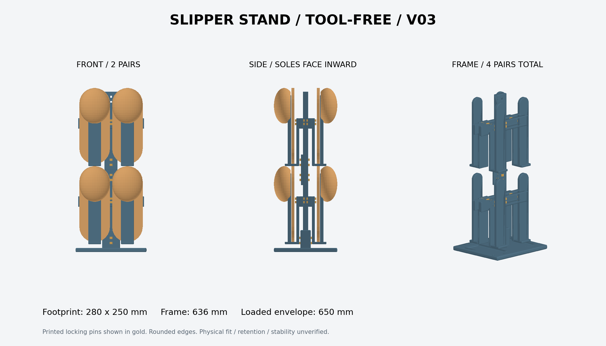
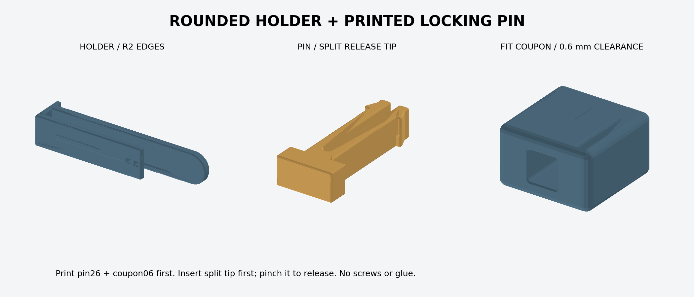

# スリッパスタンド試作 v0.3

前後各2足・上下2段で、成人用4足を収納。靴底は中央向き、甲は外側向き。
印刷した抜け止めピンで組み立てる。ねじ・ナット・接着剤は使用しない。
露出する部品の角とスリッパに触れる縁を丸めた試作モデル。

最初にpin26.stlとcoupon06.stlを各1個印刷し、差し込みと抜け止めを確認する。
部品数・組立・検証範囲は [docs/prototype.md](docs/prototype.md) を参照。

`python slipper-stand/scripts/build.py`：STL生成・検査。
`python slipper-stand/scripts/render.py`：実際のSTLから確認画像を出力。
`python slipper-stand/scripts/package.py`：配布ZIPを生成。

実印刷、実物スリッパへの適合、保持力、強度、転倒安定性は未検証。

## 印刷ファイルと個数

印刷用STLは [output/](output/) にあります。単位はmmです。

| ファイル | 個数 |
| --- | ---: |
| [base.stl](output/base.stl) | 1 |
| [mast.stl](output/mast.stl) | 2 |
| [splice.stl](output/splice.stl) | 1 |
| [rail.stl](output/rail.stl) | 4 |
| [holder.stl](output/holder.stl) | 8 |
| [pin26.stl](output/pin26.stl) | 16 |
| [pin28.stl](output/pin28.stl) | 4 |
| [pin40.stl](output/pin40.stl) | 2 |
| [pin52.stl](output/pin52.stl) | 4 |

合計42個。別途coupon06.stlを1個、必要ならcoupon04/coupon08を印刷して比較します。
テストしたpin26が使用可能なら16個に含められます。
生成されるassembly/frame/hardware/shoes.stlは表示確認用で、印刷不要です。

## 検証と再生成

リポジトリのルートで `python slipper-stand/scripts/check.py` を実行すると、
保存済みSTLの閉鎖性・単一連結・寸法・底面位置・体積と、validation.jsonの記録を検査します。
この検査は既存の全体チェックにも組み込まれています。
OpenSCADモデルの再生成は上記build.pyで別途実行します。
render.pyはbuild.pyが生成する確認用シーンも必要です。

収録STLはOpenSCAD 2021.01で生成したv0.3のスナップショットです。
CIでの検査は保存済みメッシュの検査であり、OpenSCADによる再生成や
PNGのバイト一致を確認するものではありません。再生成にはOpenSCADが別途必要です。
既存のNix環境にOpenSCADは含まれていません。

[CC BY-SA 4.0](../LICENSE.md) / Copyright © 2026 sabas0ba.
