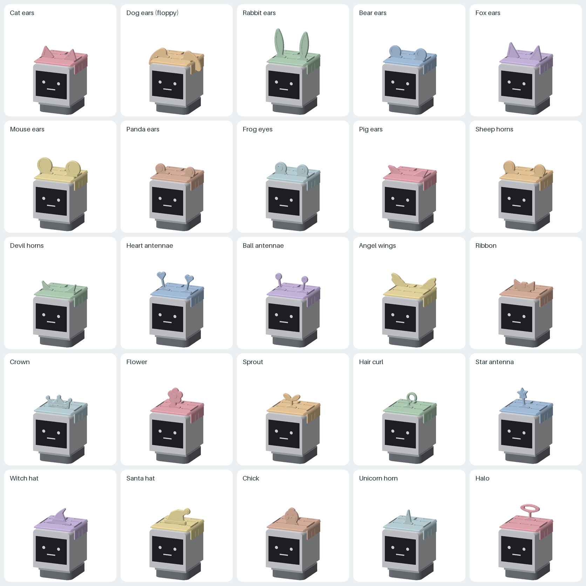
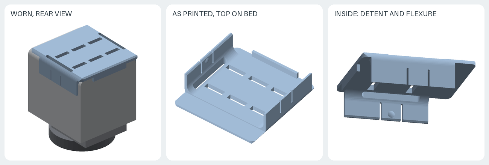
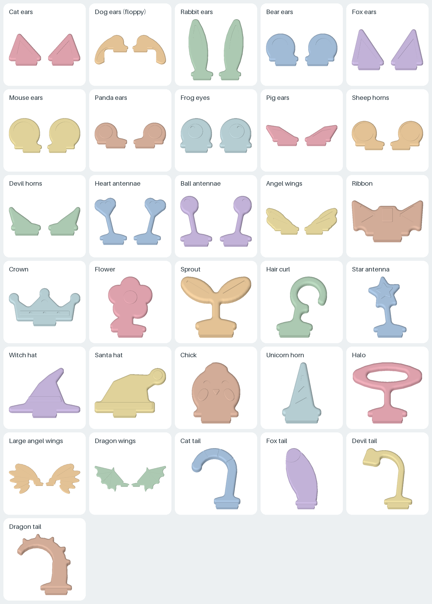
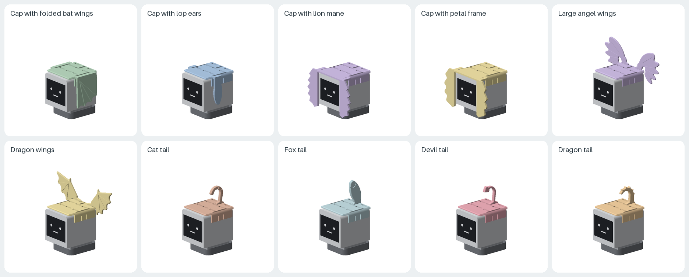
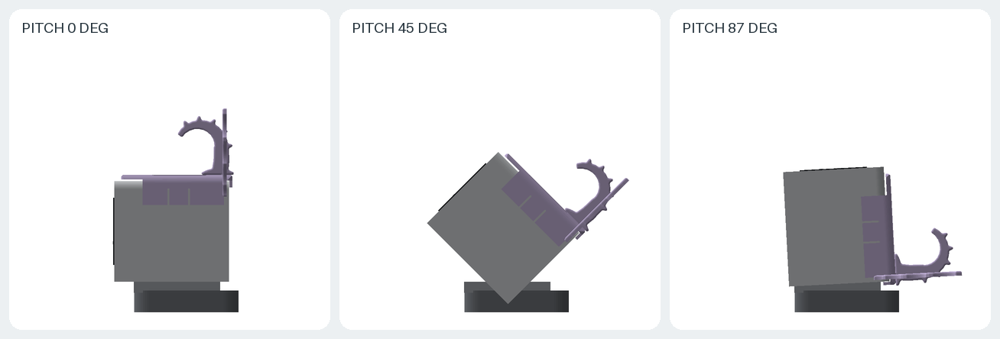

# M5Stack StackChan 用の被り物と装飾

M5Stack 社製 StackChan (SKU K151) の頭部に被せるキャップと、キャップ上面のスロットに差し込む装飾 31 セットです。動物の耳 (ねこ・いぬ・うさぎ・くま・きつね・ねずみ・パンダ・かえる・ぶた・ひつじ)、角・触角・羽・リボン・王冠・花・帽子などの小型の装飾に加え、大きな翼と尻尾を付け替えられます。翼・垂れ耳・たてがみ・花びらをキャップと一体にした変形キャップも 4 種あります。

すべて単色の FDM 印刷を前提とし、サポートは不要です。キャップは頭部へはめ込み、側面の LEGO 互換穴に入る突起で保持します。首振りとうなずきの全可動範囲で、胴体・台座・机に当たらないことを検証しています。

**実機での印刷・装着は未確認です。** 寸法は M5Stack 公開の筐体データから求めた設計値です。未検証事項は後述します。



## 構成

| 部品 | ファイル | 数 | 印刷向き |
| --- | --- | ---: | --- |
| キャップ | [`stl/cap.stl`](stl/cap.stl) | 1 | 上面を下にして印刷 |
| 変形キャップ | `stl/cap-<名前>.stl` | 1 | 上面を下にして印刷。キャップの代わりに使う |
| 装飾 | `stl/<セット名>.stl` | セットごと | 平置き。1 ファイルに左右分を配置済み |

キャップは共通で、装飾だけを差し替えます。変形キャップにも同じスロットがあり、装飾を併用できます。装飾は厚さ 3.2 mm (大きな翼は 2.0〜2.4 mm、尻尾は 4.8 mm) の板で、下端のタブ (12 × 3.2 × 2.7 mm) をキャップのスロットへ差し込みます。タブ両端の 0.25 mm の突起が圧入代になります。印刷時に上を向く面が、装着時には前を向きます。この面に浮き彫りまたは彫り込みの模様があります。





## 装飾の一覧

位置は「列-スロット」で表します。質量は PLA (1.24 g/cm³) を 100% 充填した場合の値です。

| 列 | y | スロット |
| --- | ---: | --- |
| 前列 | 12 mm | 左右 x = ±16 mm、中央 x = 0 |
| 後列 | 32 mm | 左右 x = ±16 mm、中央 x = 0 |
| 翼 | 44 mm | 左右 x = ±16 mm |
| 尻尾 | 40.7 mm | x = 0。y 方向に長いスロット |

| セット | ファイル | 部品 | 位置 | 質量 |
| --- | --- | ---: | --- | ---: |
| ねこ耳 | [`cat-ears.stl`](stl/cat-ears.stl) | 2 | 前列左右 | 1.5 g |
| いぬ耳 (垂れ耳) | [`dog-ears.stl`](stl/dog-ears.stl) | 2 | 前列左右 | 2.7 g |
| うさぎ耳 | [`rabbit-ears.stl`](stl/rabbit-ears.stl) | 2 | 前列左右 | 3.4 g |
| くま耳 | [`bear-ears.stl`](stl/bear-ears.stl) | 2 | 前列左右 | 2.0 g |
| きつね耳 | [`fox-ears.stl`](stl/fox-ears.stl) | 2 | 前列左右 | 1.9 g |
| ねずみ耳 | [`mouse-ears.stl`](stl/mouse-ears.stl) | 2 | 前列左右 | 3.2 g |
| パンダ耳 | [`panda-ears.stl`](stl/panda-ears.stl) | 2 | 前列左右 | 1.8 g |
| かえるの目 | [`frog-eyes.stl`](stl/frog-eyes.stl) | 2 | 前列左右 | 2.3 g |
| ぶた耳 | [`pig-ears.stl`](stl/pig-ears.stl) | 2 | 前列左右 | 1.2 g |
| ひつじの角 | [`sheep-horns.stl`](stl/sheep-horns.stl) | 2 | 前列左右 | 2.3 g |
| あくまの角 | [`devil-horns.stl`](stl/devil-horns.stl) | 2 | 前列左右 | 1.0 g |
| ハートの触角 | [`heart-antennae.stl`](stl/heart-antennae.stl) | 2 | 前列左右 | 1.5 g |
| まるい触角 | [`ball-antennae.stl`](stl/ball-antennae.stl) | 2 | 前列左右 | 1.4 g |
| 天使の羽 | [`angel-wings.stl`](stl/angel-wings.stl) | 2 | 後列左右 | 2.1 g |
| リボン | [`ribbon.stl`](stl/ribbon.stl) | 1 | 前列中央 | 1.6 g |
| 王冠 | [`crown.stl`](stl/crown.stl) | 1 | 前列中央 | 1.7 g |
| 花 | [`flower.stl`](stl/flower.stl) | 1 | 前列中央 | 1.8 g |
| 双葉 | [`sprout.stl`](stl/sprout.stl) | 1 | 前列中央 | 1.0 g |
| アホ毛 | [`ahoge.stl`](stl/ahoge.stl) | 1 | 前列中央 | 0.7 g |
| 星の触角 | [`star-wand.stl`](stl/star-wand.stl) | 1 | 前列中央 | 1.0 g |
| 魔女の帽子 | [`witch-hat.stl`](stl/witch-hat.stl) | 1 | 前列中央 | 1.5 g |
| サンタ帽 | [`santa-hat.stl`](stl/santa-hat.stl) | 1 | 前列中央 | 2.4 g |
| ひよこ | [`chick.stl`](stl/chick.stl) | 1 | 前列中央 | 1.6 g |
| ユニコーンの角 | [`unicorn-horn.stl`](stl/unicorn-horn.stl) | 1 | 前列中央 | 0.7 g |
| 天使の輪 | [`halo.stl`](stl/halo.stl) | 1 | 後列中央 | 1.0 g |

キャップは 12.5 g です。

前列と後列の 6 か所は同じ寸法で、小型の装飾はどれにも差せます。表の位置は、カタログ画像と検証で用いた標準配置です。左右の部品は鏡像なので、模様を前に向けると左右が決まります。

## 大型の装飾と変形キャップ





| 名前 | ファイル | 方式 | 位置 | 質量 | 大きさ |
| --- | --- | --- | --- | ---: | --- |
| こうもりの翼 (畳んだ形) | [`cap-bat-wings.stl`](stl/cap-bat-wings.stl) | 変形キャップ | 側面 | 27.5 g | 側面に垂れる膜、下端 z = -50 |
| ロップイヤー | [`cap-lop-ears.stl`](stl/cap-lop-ears.stl) | 変形キャップ | 側面 | 17.7 g | 長さ約 48 mm |
| ライオンのたてがみ | [`cap-lion-mane.stl`](stl/cap-lion-mane.stl) | 変形キャップ | 顔の左右 | 23.0 g | 全幅 105 mm |
| 花びらの縁取り | [`cap-petal-frame.stl`](stl/cap-petal-frame.stl) | 変形キャップ | 顔の左右 | 23.3 g | 全幅 105 mm |
| 大きな天使の翼 | [`large-angel-wings.stl`](stl/large-angel-wings.stl) | 装飾 2 枚、厚さ 2.0 mm | 翼左右 | 7.9 g | 全幅約 135 mm、キャップ上 37 mm |
| ドラゴンの翼 | [`dragon-wings.stl`](stl/dragon-wings.stl) | 装飾 2 枚、厚さ 2.4 mm | 翼左右 | 7.5 g | 全幅約 137 mm、キャップ上 36 mm |
| ねこの尻尾 | [`cat-tail.stl`](stl/cat-tail.stl) | 装飾、厚さ 4.8 mm | 尻尾 | 1.7 g | キャップ上 32 mm |
| きつねの尻尾 | [`fox-tail.stl`](stl/fox-tail.stl) | 装飾、厚さ 4.8 mm | 尻尾 | 4.0 g | キャップ上 42 mm |
| あくまの尻尾 | [`devil-tail.stl`](stl/devil-tail.stl) | 装飾、厚さ 4.8 mm | 尻尾 | 1.5 g | キャップ上 33 mm |
| ドラゴンの尻尾 | [`dragon-tail.stl`](stl/dragon-tail.stl) | 装飾、厚さ 4.8 mm | 尻尾 | 2.1 g | キャップ上 32 mm |

形状は次の制約から決めています。

- 変形キャップの一体部分は、キャップ上面より下に限ります。天板を下にして印刷するため、上面より上の形状は造形できません。輪郭が下へ向かって外側に広がる角度は 45° 以内です。
- 側面の板はスカートから 1.6 mm 離し、保持用の舌片がたわめるようにしています。板は頭部シェルの範囲 (y ≥ 1) に限り、CoreS3 側面のポートを覆いません。顔の左右の板は CoreS3 前面より前にあり、画面とカメラを覆いません。
- 上を向くと、頭部の後ろ側が台座の上へ倒れます。後方へ張り出す形状は台座や机に当たるため、大きな翼はキャップ上面の後端 (y = 44 mm) に立て、尻尾は後ろで立ち上がって頭の上へ前向きに巻く形にしています。
- 小型の装飾と同じく、上を向く翼・尻尾は別部品として平置きで印刷します。

## 可動範囲と干渉

うなずき軸は x 方向で、頭部座標の y = 18.4 mm、z = -27.0 mm にあります。頭部シェル左右の側壁内側にあるアーム受け座の円弧から求めました (当てはめ誤差 0.003 mm)。うなずきの範囲は、正面を水平に見る姿勢を 0° として上向きに 0〜87° です。首振りは ±128° です。範囲は公式ファームウェアの設定値です ([m5stack/StackChan](https://github.com/m5stack/StackChan) `firmware/main/hal/hal_servo.cpp`、pitch `angleLimit` 30〜870 (0.1° 単位)、yaw `angleLimit` ±1280)。0 点は校正画面の「StackChan looking straight forward.」の姿勢です。

`generate.py` は、各部品と、キャップに装着した各セットの表面を 1 mm 以下の間隔で点に分けます。うなずきを 1° 刻みで回し、次の障害物から 1.0 mm 以上離れていることを確かめます。

- 胴体 (ServoBody とカバー): 高さ 3 mm ごとの帯で表したシルエットです。頭部の天板と CoreS3 の上にある点は、頭部シェルが間にあるため対象外です。
- 台座: 首振りで回るため、首振り軸からの距離ごとの上面高さで表します。半径 24 mm まで z = -57.8、28 mm まで -58.8、36.8 mm まで -60.9 です。
- 机: z = -70.5 (製品高さ)。

いずれも M5_Hardware の `StackChan-ServoBody.stl`、`StackChan-ServoCover.stl`、`StackChan-ServoSideCover.stl`、`StackChan-Base.stl` から計測しました。これらの部品は互いに共通の組立座標で収録されていますが、頭部シェル (MainBody) とは y 方向の位置がずれています。z は組立位置のままで、ServoBody のピンの高さは受け座から求めたうなずき軸と 0.4 mm 以内で一致しました。y はピンをうなずき軸に合わせて決め、首振り軸は台座の軸受け中心から y = 19.2 mm としました。

公式 STL を用いたローカルの照合も行いました。

- 頭部シェルを上向きに 0〜87° 回すと、ServoBody との干渉は 0 でした。下向きでは 10° で干渉します。この結果から、軸の位置と回転方向の判断を確かめています。
- キャップ、変形キャップ 4 種、大型の装飾 6 種の表面点を、うなずき 0〜87° (1° 刻み) と首振り ±128° (4° 刻み) の全組み合わせで照合しました。ServoBody と台座 (いずれも voxel 化) の内部に入る点は 0 でした。

公式 STL を含めないため、この照合は CI では実行しません。

## サーボの負荷

うなずき用サーボは Feetech の SCS 系です。ファームウェアは `SCSCL` ドライバを使い、販売店の仕様では SCS0009 の定格トルクは 0.7 kg·cm (ストール 2.3 kg·cm) です。キャップと装飾がうなずき軸まわりに加える重力モーメントの上限を、定格の約 2 割の 150 g·cm としました。

- 装着した各構成 (キャップ + 1 セット、変形キャップ単体) は、うなずき範囲での最大モーメントが上限以下であることを検査します。最大は大きな天使の翼の 70.8 g·cm です。
- 組み合わせの上界も検査します。最も重い変形キャップに、スロットの各群で最も重い装飾を 1 つずつ加え、各部品の最大モーメントを足し合わせます。上界は 144.4 g·cm です。干渉して同時に付けられない組み合わせも含めた値なので、実際のどの組み合わせもこれ以下になります。

頭部と CoreS3 自体の負荷は含みません。上限は設計上の目安であり、実機での負荷は測定していません。

### 組み合わせ

耳と中央の装飾は同時に付けられます。中央の装飾を後列中央に差せば、どの耳とも干渉しません。前列中央に並べたときに干渉しない組み合わせは次のとおりです。[`validation.json`](validation.json) の `conflicting_pairs` は、別々のスロットに差したときに重なる組を自動判定した結果です。同じスロットを使う組は同時に付けられないため、一覧には含めていません。

| 耳など | 前列中央に併用できる装飾 |
| --- | --- |
| ねこ耳 | 王冠、双葉、アホ毛、ユニコーンの角 |
| いぬ耳、パンダ耳、ぶた耳、ひつじの角、あくまの角、ハートの触角、まるい触角 | 双葉、アホ毛、星の触角、ユニコーンの角 |
| きつね耳 | 双葉、アホ毛、ユニコーンの角 |
| くま耳 | 双葉、星の触角、ユニコーンの角 |
| うさぎ耳、ねずみ耳 | 星の触角、ユニコーンの角 |
| かえるの目 | ユニコーンの角 |
| 天使の羽 (後列) | 前列中央の全装飾 |

そのほかに、次の組は重なります。

- こうもりの翼のキャップ: いぬ耳、ドラゴンの翼
- ロップイヤーのキャップ: いぬ耳
- 天使の輪 (後列中央): 尻尾 4 種

## 取り付け

1. キャップの前縁 (左右の側壁がない側) を CoreS3 の画面側に向けます。
2. 頭部の上から真下へ押し込みます。側壁内側の突起 (高さ 0.6 mm) が、側面中央の LEGO 互換穴に入って止まります。突起は側壁のスリットで区切った舌片の上にあり、舌片が外側へたわみます。
3. 後縁のリップ (幅 32 mm、高さ 3.8 mm) が頭部の後端にかかり、前方向へのずれを止めます。
4. 装飾のタブをスロットへ差し込みます。外すときは装飾の根元をつまんで真上に引きます。

キャップ上面の左右の細長い窓は、頭部上面の LED 導光バーの位置に合わせてあります。LED の光は装着後も見えます。

## 寸法

単位は mm です。座標は頭部中心を x = 0、頭部シェル (MainBody) の前面を y = 0、頭部上面を z = 0 とします。

| 項目 | 値 | 出典 |
| --- | --- | --- |
| 頭部の幅・高さ | 54.0 × 54.0 | MainBody の実測 |
| 頭部シェルの奥行 | 46.7 (側壁は 44.7 まで) | MainBody の実測 |
| CoreS3 前面の位置 | y = -14.8 | 製品奥行 61.5 から算出 |
| 上面と側面の稜の半径 | 約 4.5 | MainBody 断面の実測 |
| 側面の LEGO 互換穴 | 片側 3 個、y = 11.8 / 19.8 / 27.8、z = -10.0、直径 6.4 | MainBody の実測 |
| 上面の LED 導光スロット | x = ±25.5、y = 5.5〜35.0、幅 1.6 | MainBody の実測 |
| キャップ外形 | 57.8 × 59.6 × 16.3 | 設計値 |
| 頭部とのすき間 | 0.3 (CoreS3 上面は 0.9) | 設計値 |
| 天板 / 側壁の厚さ | 3.0 / 1.6 | 設計値 |
| 側壁の下端 | z = -13.0 | 設計値 |
| スロット | 12.3 × 3.4、深さ 3.0 (貫通) | 設計値 |
| 装飾の厚さ | 3.2、模様を含めて 4.0 | 設計値 |

### 出典

- [m5stack/M5_Hardware](https://github.com/m5stack/M5_Hardware/tree/a240115c94b19ecf647f229c47fa9a8ce46ccdc4/Products/K151_StackChan/Structures) (commit `a240115c94b19ecf647f229c47fa9a8ce46ccdc4`、MIT License) の `StackChan-MainBody.stl` を計測しました。この STL は本リポジトリに含めず、計測値だけを [`head.py`](head.py) に記録しています。
- [M5Stack 公式ドキュメント StackChan (K151)](https://docs.m5stack.com/en/StackChan): 製品サイズ 54.0 × 70.5 × 61.5 mm。
- 前後の向きは、[m5stack/StackChan](https://github.com/m5stack/StackChan) の製品画像 `app/assets/lateral_image.png` と照合して決めました。CoreS3 は MainBody の y = 0 側にあり、LEGO 互換穴は前寄り上部、面取りは後下部にあります。

## 印刷

- 材料は PLA を想定しています。層高 0.2 mm、サポートなしで印刷します。
- キャップは STL のとおり、上面を造形面に置きます。側壁は上向きになります。
- 装飾は STL のとおり平置きにします。STL の上側の面に模様があり、装着時に前を向きます。尻尾は模様の面が右側面を向きます。
- 変形キャップは印刷高さが最大 64 mm になります。側面や前面の板は根元だけで天板とつながるため、最初の数層が造形面から剥がれないよう、ブリムの使用を推奨します。
- こうもりの翼の指骨は外面の V 溝です。溝の壁が 45° なので、サポートなしで印刷できます。
- 天板のスロットの角は、1 層目のはみ出しで狭くなることがあります。スライサーの elephant foot 補正を有効にするか、タブが入らない場合は `cap.py` の `SLOT_LENGTH` と `SLOT_WIDTH` を広げて再生成します。
- 頭部へのはまりがきつい場合は `cap.py` の `CLEARANCE` を、突起の保持が強すぎる場合は `DETENT_HEIGHT` を調整します。

## 検証

`generate.py` は次を検査し、1 つでも満たさない場合は異常終了します。結果は [`validation.json`](validation.json) に記録します。

- 各部品が有効な単一ソリッドであること。
- 印刷向きで最下点が z = 0 にあり、造形面に接していること。
- 45° より緩いオーバーハングの面積が 1 mm² 以下であること (サポート不要の判定)。現状の最大は魔女の帽子の 0.04 mm² です。
- キャップと変形キャップが、頭部の包絡形状 ([`head.py`](head.py) の `envelope`) と干渉しないこと。突起が側面穴に入り込んでいること (計 1.64 mm³)。
- うなずきの全範囲で、胴体・台座・机から 1.0 mm 以上離れていること。うなずき軸まわりの重力モーメントが上限以下であること (前 2 節)。
- 装飾の本体がタブの上を覆っていること。装着位置で、本体がキャップに食い込まないこと。タブの圧入代が想定範囲にあること (各 0.15 mm³)。装飾と頭部の間が 0.5 mm 以上離れていること。

加えて、公式の `StackChan-MainBody.stl` をローカルで点群として照合しました。キャップ材料の内部に入る点は 76,747 点中 0、頭部上面とキャップ下面の最小距離は 0.3 mm でした。公式 STL を含めないため、この照合は CI では実行しません。

画像はすべて [`render.py`](render.py) が CAD モデルから描画します。頭部と台座は文脈を示すための簡略形状で、印刷用ではありません。

## 未検証事項

- 実機での印刷、装着、保持力を確認していません。突起の高さ 0.6 mm と舌片のたわみ量は計算上の値です。
- CoreS3 の上面が MainBody の上面と同じ高さにあることは、製品画像からの判断です。CoreS3 の上側は 0.6 mm の逃げを設けて覆っています。
- 公式ファームウェアには、3 区画とスワイプを扱う頭部タッチのドライバ (`hal_head_touch.cpp`、Si12T) があります。センサーの位置は確認していません。名称から頭部上面と推定され、その場合はキャップがタッチ操作を妨げる可能性があります。
- サーボへの負荷は計算値で、実機では測定していません。うなずき用サーボの型番は、ファームウェアのドライバと他者の解析による推定です。
- 胴体と台座の位置は、公式 STL の座標と頭部シェルとの整合から推定しています。実機での可動範囲は個体の校正値によって変わります。
- 公式 STL と照合したのは MainBody だけです。CoreS3 本体の外形は製品寸法から推定しています。

## 再生成

[リポジトリの README](../README.md) の Nix またはコンテナの手順で、他の設計と同時に再生成・検査できます。この設計だけを再生成する場合は次を実行します。

```sh
nix develop --command .venv/bin/python stackchan-hats/generate.py
nix develop --command .venv/bin/python stackchan-hats/render.py
```

STL は三角形の順序を正規化して書き出すため、同じ環境ではバイト単位で同一になります。

| ファイル | 内容 |
| --- | --- |
| [`head.py`](head.py) | 頭部の計測値と包絡形状、可動範囲と障害物、掃引検査 |
| [`cap.py`](cap.py) | キャップの形状、スロットとタブの寸法 |
| [`toppers.py`](toppers.py) | 装飾の 2D 輪郭と模様の定義 |
| [`integral.py`](integral.py) | 変形キャップの一体部分 |
| [`generate.py`](generate.py) | STL 出力と検査 |
| [`render.py`](render.py) | 画像の描画 |

License: [CC BY-SA 4.0](../LICENSE.md)。本設計は独立したアクセサリーであり、M5Stack の公式製品ではありません。M5Stack および StackChan は各権利者の商標または製品名です。
