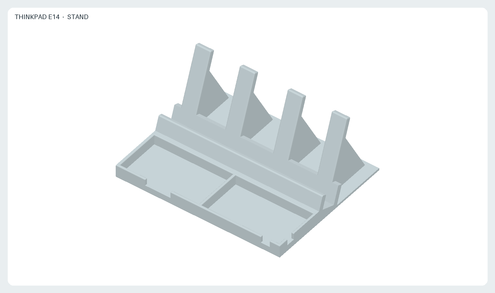
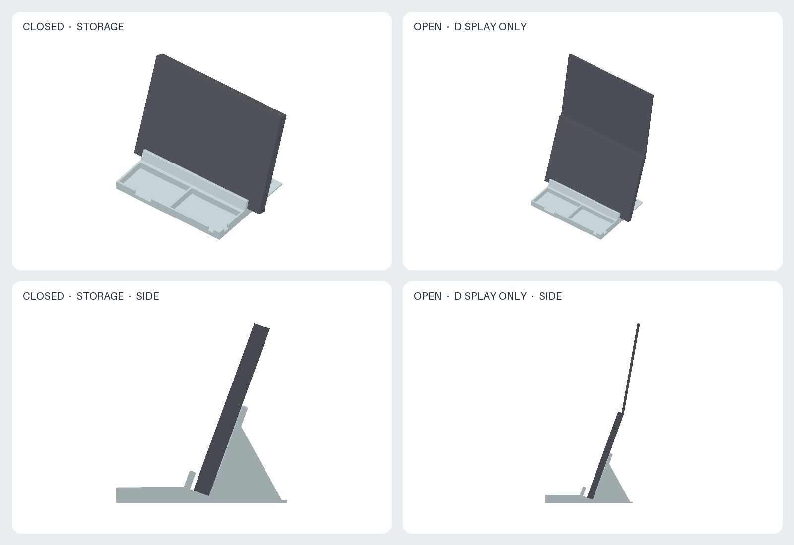
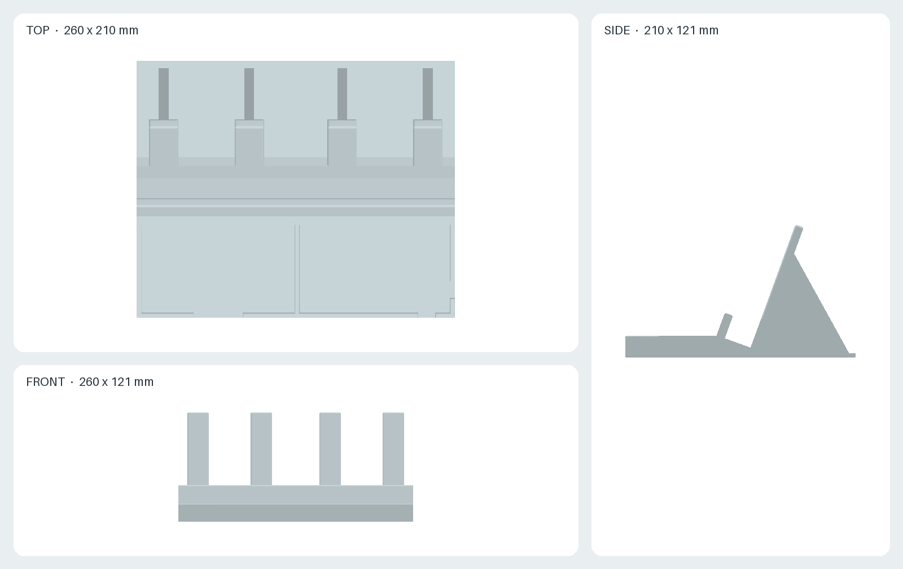

# ThinkPad E14 stand

A one-piece desk stand for ThinkPad E14 (AMD). A single slot, reclined 20° from vertical, serves two uses, one at a time:

- **Closed, storage**: the closed notebook stands on its long edge in the slot.
- **Open, display only**: the front edge of the base half stands in the slot, keyboard facing the user, and the display rises above it. The keyboard is not usable in this position. The hinge angle sets the display tilt: at 180° the display leans back 20°, at 160° it is vertical.

Two open trays in front of the slot hold the AC adapter and a mouse. The adapter tray has U-shaped cable exits at its front and outer side; the mouse tray has a finger notch.

- [`stand.stl`](stand.stl): one printable part, 260 × 210 × 121 mm.
- [`generate.py`](generate.py): parametric CadQuery source, dimensions in mm. It also checks that box-shaped notebook proxies (closed, and base half only) do not intersect the stand.
- [`views.png`](views.png): orthographic top, front, and side views.
- [`preview.png`](preview.png): rendered 3D view from the user side.
- [`usage.png`](usage.png): both uses with a box-shaped notebook proxy; the open view assumes a 170° hinge angle.
- [`render.py`](render.py): deterministic offline rendering script.

## Dimensions

| Feature | Value |
| --- | --- |
| Slot gap, normal to the back face | 25 mm |
| Slot recline from vertical | 20° |
| Back-face ribs | 4 × 24 mm wide, 120 mm along the face |
| Front lip | 22 mm along the face |
| Mouse tray, interior | 125 × 72 mm, 16 mm deep |
| Adapter tray, interior | 123 × 72 mm, 16 mm deep |
| Cable exits | 14 mm wide, 10 mm above the desk |
| Base behind the slot | 96 mm |

The stand is shorter than the notebook (260 mm against 313 mm), so the notebook overhangs both ends by about 26 mm and the side ports stay accessible. The back face is reduced to four ribs above its lowest 28 mm, so the bottom cover touches the stand only along narrow strips.

## Sources and design assumptions

- Lenovo PSREF, ThinkPad E14 [Gen 5 (AMD)](https://psref.lenovo.com/Detail/ThinkPad_E14_Gen_5_AMD?M=21JR005GGR), [Gen 6 (AMD)](https://psref.lenovo.com/Product/ThinkPad/ThinkPad_E14_Gen_6_AMD), [Gen 7 (AMD)](https://psref.lenovo.com/syspool/Sys/PDF/ThinkPad/ThinkPad_E14_Gen_7_AMD/ThinkPad_E14_Gen_7_AMD_Spec.pdf) and [Gen 8 (AMD)](https://psref.lenovo.com/syspool/Sys/PDF/ThinkPad/ThinkPad_E14_Gen_8_AMD/ThinkPad_E14_Gen_8_AMD_Spec.PDF): **313 × 219.3–220.3 mm**, at most **20.5 mm** thick, starting at **1.34–1.44 kg** depending on generation. The 25 mm slot gap covers the thickest of these configurations. Gen 2 (AMD) is 324 mm wide and up to 20.5 mm thick; it also fits the slot.
- The maximum hinge angle was not confirmed from a primary source. If the hinge stops well short of 160°, the display leans toward the user in the open position.
- The 15 mm thickness of the base half, used in the open-use clearance check and the usage view, is an assumption. PSREF lists overall thickness only.
- The adapter and mouse trays were sized without measuring a specific adapter or mouse. Check that the adapter, including its cable strain reliefs, fits 123 × 72 mm before printing, and change `MOUSE_LENGTH`, `TRAY_DEPTH` or `LENGTH` in `generate.py` if needed.
- Rearward tipping in the open position, as a rough estimate: assuming 60% of the mass in the base half and 40% in the display, at a 180° hinge angle the combined centre of mass lies about 68 mm behind the bottom of the back face, inside the 96 mm of base behind it. The stand's own mass is not included. Check stability with the actual notebook before leaving it unattended.

## Printing

Print with the flat underside on the bed; no supports are needed. The ribs and the lip lean back 20°, which is within the usual overhang limit. At 260 × 210 mm it does not fit a 256 × 256 mm bed; it fits the Bambu Lab A2L (330 × 320 mm published build area). PLA is sufficient for storage; the stand is not intended to hold a notebook that is heating up under load for long periods.

To protect the notebook's finish and the desk, consider adhesive felt on the rib faces and the slot floor, and rubber feet under the base. Felt on the slot floor raises the notebook and reduces the effective lip height.

The STL was generated with Python 3.12 and CadQuery 2.7.0; the images use NumPy 2.3.5 and Pillow 12.3.0. Use the pinned Nix and container commands in the [repository README](../README.md) to regenerate and check all outputs. After changing the geometry, inspect the result and verify that it is a valid, single closed solid before printing.

License: [CC BY-SA 4.0](../LICENSE.md). This is an independent accessory and is not an official Lenovo product. ThinkPad is a trademark of Lenovo.
